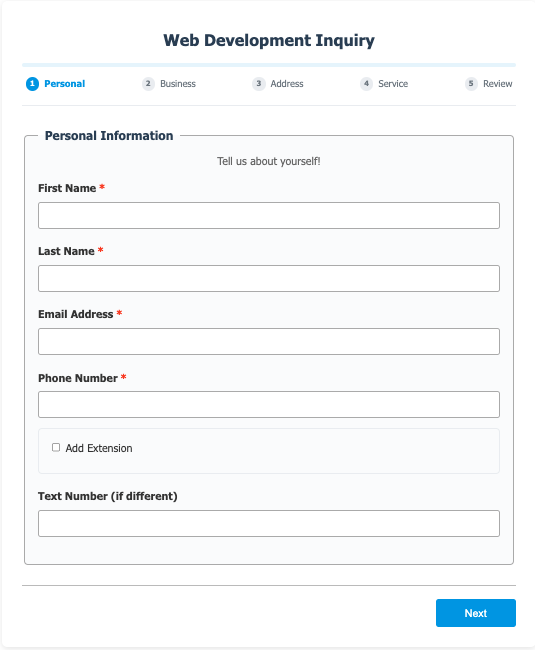
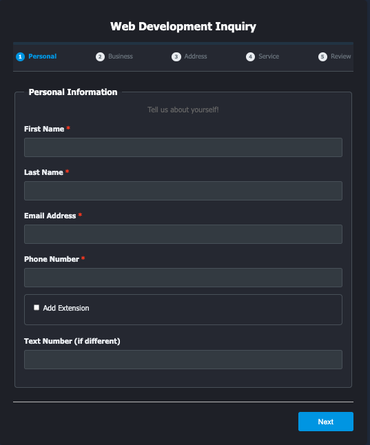
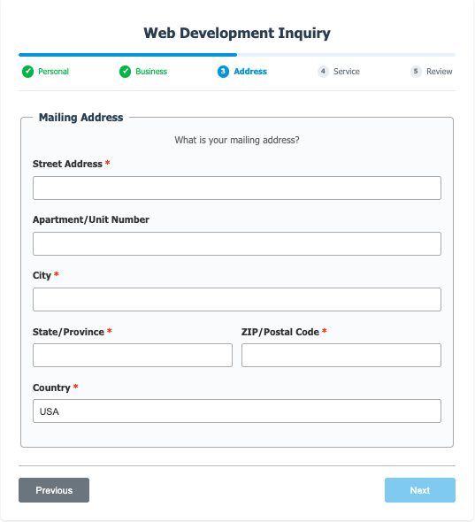

# Developer Portfolio Template


A clean, modern developer portfolio template with light and dark theme support. Perfect for showcasing your skills, projects, and experience as a software developer.

## Features

- **Light/Dark Theme Toggle** - Automatic theme switching with system preference detection
- **Fully Responsive** - Works on all device sizes
- **Modern Design** - Clean, professional layout with smooth animations
- **SEO Optimized** - Enhanced meta tags (Open Graph, Twitter Cards, JSON-LD) for better search visibility
- **Contact Form Integration** - Built-in web inquiry form component
- **Optional Blog Integration** - Hashnode GraphQL API example (commented out, ready to use)
- **Optional Web Components** - Typewriter effect, custom cursor, and back-to-top button
- **Accessibility** - ARIA labels and semantic HTML throughout
- **Fast & Lightweight** - Pure HTML, CSS, and JavaScript
- **Easy to Customize** - Well-organized code with TODO comments

## Quick Start

1. **Clone the repository**
   ```bash
   git clone https://github.com/DevManSam777/portfolio_template.git
   cd portfolio_template
   ```

2. **Open in browser**
   ```bash
   # Simply open index.html in your browser
   open index.html
   ```

3. **Customize**
   - Look for `TODO` comments throughout the code
   - Replace placeholder text with your actual information
   - Update `index.html` to update content
   - Modify `styles.css` for styling changes
   - Update `script.js` for functionality tweaks

## Customization

### Personal Information
Edit the following sections in `index.html`:
- **SEO Meta Tags** (in `<head>`) - Update with your name, website URL, social media handles
- **Hero section** - Your name, title, and description
- **About section** - Your bio, skills, and experience
- **Skills section** - Replace "Skill 1, 2, 3..." with your actual technologies
- **Projects section** - Replace "Project 1, 2, 3..." with your real projects
- **Contact information** - Your social media links and email

### Skills & Technologies
Update the skills grid in the HTML to match your tech stack:
```html
<div class="skill-category">
    <h3><i class="fas fa-code"></i> Frontend</h3>
    <ul class="skill-list">
        <li>Your Technology</li>
        <!-- Add more skills -->
    </ul>
</div>
```

### Colors & Styling
Customize the color scheme by modifying CSS variables in `styles.css`:
```css
:root {
    --primary-color: #2563eb;
    --secondary-color: #1e40af;
    --accent-color: #f59e0b;
    /* Update colors to match your brand */
}
```

### Contact Form

The portfolio includes the [web-inquiry-form](https://github.com/DevManSam777/web_inquiry_form) web component.

**Option 1: Use DevLeads (Recommended)**

[DevLeads](https://github.com/devmansam777/devleads) is a complete lead/project management system that:
- Sends email notifications to you and your clients
- Tracks and manages leads/projects
- Provides a dashboard to view all inquiries
- Includes a built-in API endpoint for the form

Simply deploy DevLeads and update the form's `api-url` attribute to point to your DevLeads instance.

**Option 2: Use Your Own API**

Create your own backend API endpoint and update the `api-url` attribute in the `<web-inquiry-form>` element.

**Option 3: Replace the Form**

Replace the `<web-inquiry-form>` element with your preferred form solution and update the styling in CSS if needed.

### Optional Features

**Blog Integration:**
The template includes commented-out code for fetching blog posts from Hashnode's GraphQL API.

To enable:
1. Uncomment the blog section in `index.html`
2. Uncomment the blog functions in `script.js`
3. Update the Hashnode blog URL in the `fetchHashnodePosts()` function
4. Uncomment the blog nav link

**Optional Web Components:**
Uncomment these in `index.html` if you want to use them:
- **Typewriter Effect** - Animated typing text
- **Custom Cursor** - Custom mouse cursor design
- **Back-to-Top Button** - Smooth scroll to top

All web components are by [DevManSam777](https://github.com/DevManSam777).

## File Structure

```
portfolio_template/
├── index.html          # Main HTML file
├── styles.css          # All styling and themes
├── script.js           # JavaScript functionality
├── assets/             # Images and icons
│   └── code_icon.png
└── README.md          # This file
```

## Browser Support

- Chrome 
- Firefox
- Safari
- Edge

## Contributing

Feel free to clone this project and make it your own! If you find bugs or have suggestions for improvements, please open an issue or submit a pull request.

## Credits

- Icons by [Font Awesome](https://fontawesome.com/)
- Font family: Nunito by Google Fonts
- Web components by [DevManSam777](https://github.com/DevManSam777)








## License
[LICENSE](LICENSE)

Copyright (c) 2025 DevManSam
