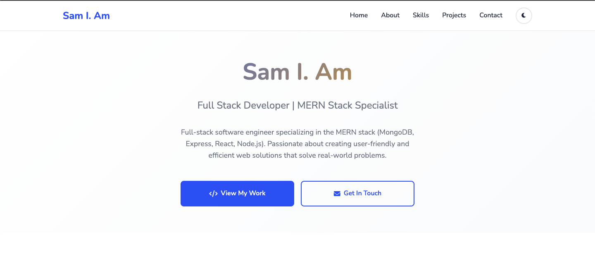
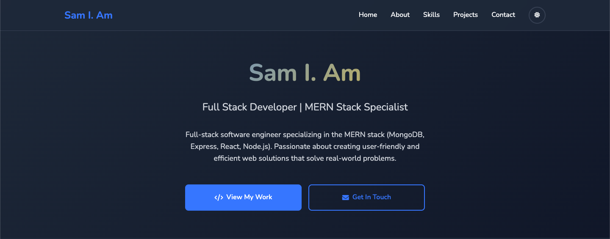
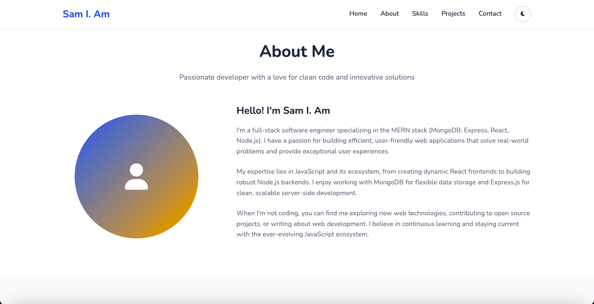
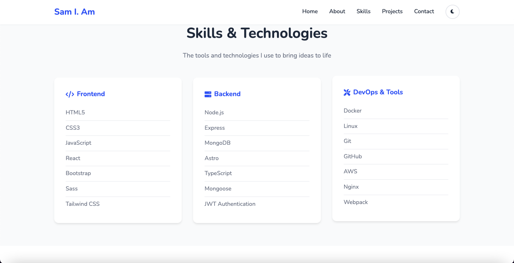
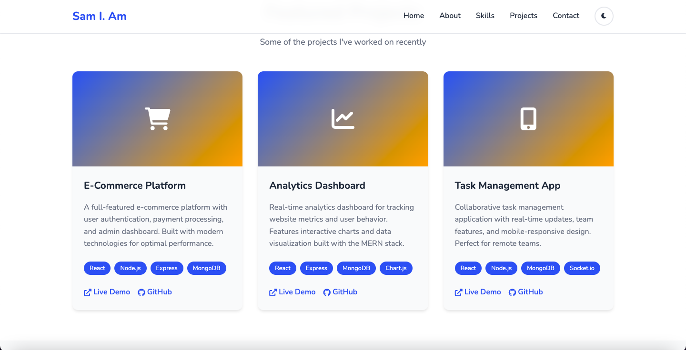
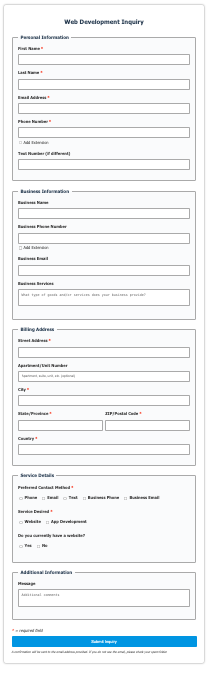
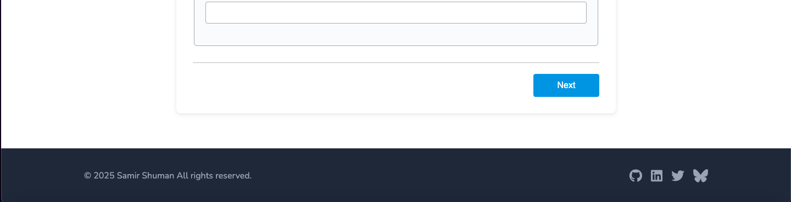

# Developer Portfolio



 
A clean, modern developer portfolio website with light and dark theme support. Perfect for showcasing your skills, projects, and experience as a software developer.

## Features

- **Light/Dark Theme Toggle** - Automatic theme switching with system preference detection
- **Fully Responsive** - Works on all device sizes
- **Modern Design** - Clean, professional layout with smooth animations
- **Contact Form Integration** - Built-in web component for client inquiries
- **Fast & Lightweight** - Pure HTML, CSS, and JavaScript
- **Easy to Customize** - Well-organized code structure

## Quick Start

1. **Clone the repository**
   ```bash
   git clone git@github.com:DevManSam777/portfolio_template.git
   cd portfolio_template
   ```

2. **Open in browser**
   ```bash
   # Simply open index.html in your browser
   open index.html
   ```

3. **Customize**
   - Edit `index.html` to update content
   - Modify `styles.css` for styling changes
   - Update `script.js` for functionality tweaks

## Customization

### Personal Information
Edit the following sections in `index.html`:
- Hero section (name, title, description)
- About section (bio, skills, experience)
- Projects section (your work and achievements)
- Contact information

### Skills & Technologies
Update the skills grid in the HTML to match your tech stack:
```html
<div class="skill-category">
    <h3><i class="fas fa-code"></i> Frontend</h3>
    <ul class="skill-list">
        <li>Your Technology</li>
        <!-- Add more skills -->
    </ul>
</div>
```

### Colors & Styling
Customize the color scheme by modifying CSS variables in `styles.css`:
```css
:root {
    --primary-color: #2563eb;
    --secondary-color: #1e40af;
    --accent-color: #f59e0b;
    /* Update colors to match your brand */
}
```

### Contact Form
The portfolio includes a web inquiry form component. 

- Feel free to use the included web component: https://github.com/DevManSam777/web_inquiry_form

To use your own contact form:

- Replace the `<web-inquiry-form>` element with your preferred form solution
- Update the form styling in CSS if needed


## File Structure

```
portfolio/
├── index.html          # Main HTML file
├── styles.css          # All styling and themes
├── script.js           # JavaScript functionality
└── README.md          # This file
```

## Browser Support

- Chrome (recommended)
- Firefox
- Safari
- Edge

## Contributing

Feel free to fork this project and make it your own! If you find bugs or have suggestions for improvements, please open an issue or submit a pull request.

## License

This project is open source and available under the [MIT License](LICENSE).

## Credits

- Icons by [Font Awesome](https://fontawesome.com/)
- Font family: Nunito by Google Fonts






